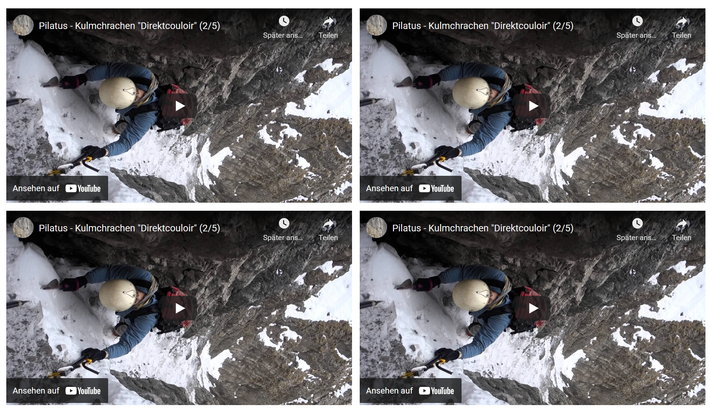

# Contao Bootstrap Responsive Youtube Embed
This bundle provides a [Youtube/Vimeo/Dropbox Player](https://getbootstrap.com/docs/5.2/helpers/ratio/#example) content element for the [Contao CMS](https://contao.org/).
Create responsive video embeds based on the width of the parent by creating an intrinsic ratio that scales on any device.



## Video Id
In the backend you have to fill in the video id input.

| Youtube                                                                     | Vimeo                                                       | Dropbox                                                                                           |
|-----------------------------------------------------------------------------|-------------------------------------------------------------|---------------------------------------------------------------------------------------------------|
| https://www.youtube.com/watch?v=###movieId###                               | https://vimeo.com/###movieId###                             | https://dl.dropboxusercontent.com/s/###movieId###                                                 |
| Get the shareable youtube link: https://www.youtube.com/watch?v=a7D3A_wwl0g | Get the shareable vimeo link: https://vimeo.com/479750109   | Get the shareabe dropbox link: https://dl.dropboxusercontent.com/s/wtx6x44y61wsxj/sample.mp4?dl=0 |
| Everything from "?v=" belongs to the movieId => a7D3A_wwl0g                | Everything from ".com/" belongs to the movieId => 479750109 | Everything from ".com/s/" belongs to the movieId => wtx6x44y61wsxj/sample.mp4?dl=0                |

## Contao Inserttag

The extension supports Contao Insert tags to embed videos.

```
<div>
    {{bootstrapResponsiveYoutubeEmbed::a7D3A_wwl0g}}
    <!-- or a bit more complex -->
    {{bootstrapResponsiveYoutubeEmbed::a7D3A_wwl0g?autoplay=1&caption=Lorem ipsum&playerAspectRatio=4x3}}
</div>

```
